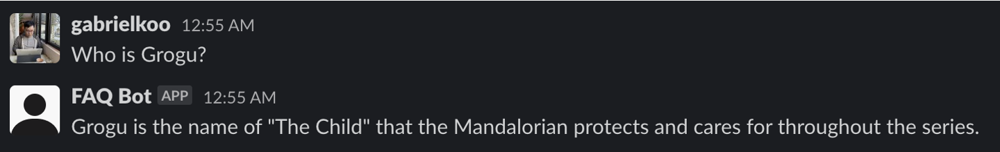
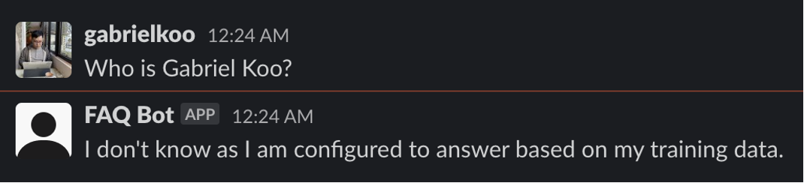
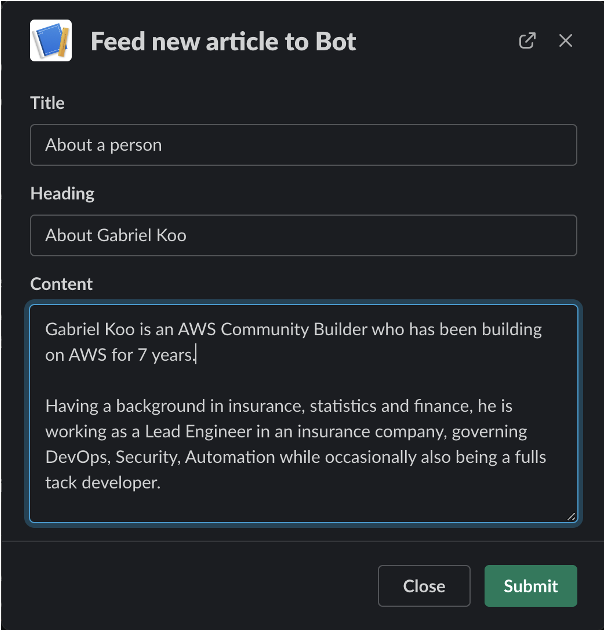
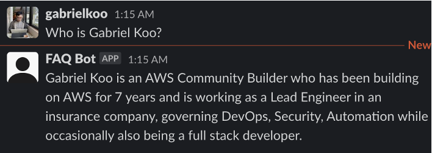
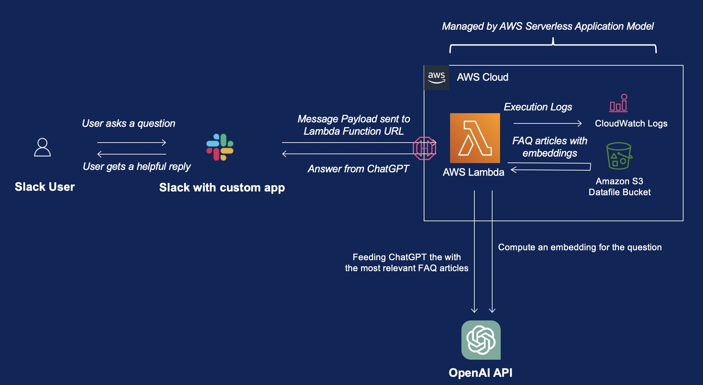
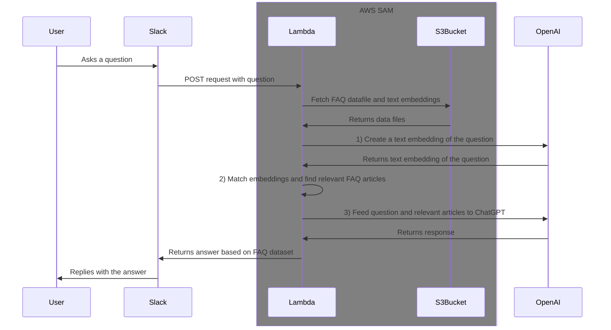
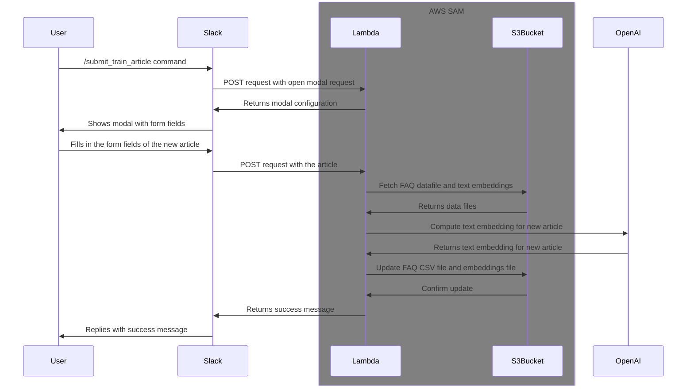
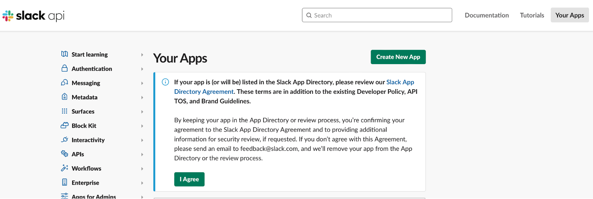
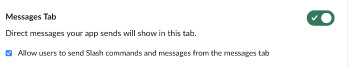

# chatgpt-faq-slack-bot


<!-- GitAds-Verify: VKX6LQT126SMYIM4S794ZKV5VQ9C1NHN -->

**UPDATE [2024-07-17]**: I have created another repo with similar functionality but with all AWS services only. Though it requires more experience on e.g. AWS VPC and Amazon Aurora's query editor, but it should be more robust and scalable than the solution in this repo. Do take a look! [gabrielkoo/self-learning-rag-it-support-slackbot](https://github.com/gabrielkoo/self-learning-rag-it-support-slackbot).

---

The bot uses ChatGPT to answer based on your own FAQ database, while allowing users to submit new articles into it with a [Slash Command](https://slack.com/help/articles/201259356-Slash-commands-in-Slack), so that it can answer with new knowledge **immediately**, as it updates the model **on the fly in the cloud**!

Read my [dev.to](https://dev.to) article below to know more about why and how I created this solution!

I have also included a pricing estimate on the cost breakdown of using this solution (it's at US$0.009 per question as of Apr 2023 pricings).

https://dev.to/aws-builders/enhance-your-slack-workspace-with-a-user-trainable-chatgpt-integrated-faq-bot-2pj3

## Example

A sample dataset is included in the `./sample_data` directory, and it's built based on Wikipedia pages on the Disney+ series "The Mandalorian".

So it does know who is Grogu:


But doesn't know who I am:


So I can submit a new article to the bot:


And now the bot knows how to answer my question:


## Background

Since ChatGPT's API became available in 2023 Mar, the world has been of great hype on building a lot of great integrations around it. Two of these integrations are especially appealing to me:

1. [Combing Embedding Search with ChatGPT](https://github.com/openai/openai-cookbook/blob/main/examples/Question_answering_using_embeddings.ipynb) to build a FAQ engine - it's a way of:
[Knowledge Base Question Answering (KBQA)](https://arxiv.org/pdf/2108.06688.pdf) - combining

   - natural language understanding (via a text embedding on the question)
   - information retrieval (via a text embedding on the articles, matches  against the one for the question)
   - knowledge representation (via ChatGPT with the selected information)

2. Connecting the AI with a programmable messaging platform like Slack

But so far, I have not seen any open-source project that:

1. combines the two together
2. provides a easy hosting method like AWS SAM, and lastly
3. provides a functionality to **let the user submit extra knowledge into the embedding dataset**.

The **3rd** point is very important to me, because in this post-OpenAI era, you should no longer rely on an expensive data scientist to build a FAQ engine for you. Instead, you should let your users submit their own knowledge into the dataset, so that the AI can learn from the collective intelligence of your users.

So I decided to build one myself.

## Architecture and Infrastructure

The infrastructure is built with AWS SAM, and it consists of the following components:

- A Lambda function that handles the Slack API requests, it's possible with the new [Function URL](https://aws.amazon.com/blogs/aws/announcing-aws-lambda-function-urls-built-in-https-endpoints-for-single-function-microservices/) feature that was released in 2022. This saves us from the trouble of setting up an API Gateway.
- A AWS S3 bucket to store the datafiles, that includes a CSV file of the articles, and a CSV file of the document embeddings.

Yeah that's it! With [AWS SAM](https://aws.amazon.com/serverless/sam/), things are simply so simple, and all these are defined in `template.yml`.



Sequence diagram for the Q&A flow:



Sequence diagram for the new training article submission flow:



## Pre-requisites

- Prepare a `.env` file at the root directory, according to the template `.env.example`.
- AWS SAM CLI - [Install the SAM CLI](https://docs.aws.amazon.com/serverless-application-model/latest/developerguide/serverless-sam-cli-install.html)
- Docker - [Install Docker](https://docs.docker.com/get-docker/)
- An OpenAI API Key
  - [Get an OpenAI API Key](https://platform.openai.com/docs/api-reference/authentication) and put it in the `OPENAI_API_KEY` environment variable.
  - Alternatively, you can also get one from Azure if you have access to the [Azure OpenAI Service](https://azure.microsoft.com/en-us/products/cognitive-services/openai-service).
- A Slack App - [Create a Slack App](https://api.slack.com/apps?new_app=1)

### Create a Slack App



The following scopes are required (Configure in the "OAuth & Permissions" page > "Scopes" > "Bot Token Scopes"):

- `chat:write`
- `commands`
- `im:history`
- `im:write`

The following event subscriptions are required:
(but you can't set these yet until the deployment of the AWS SAM infrastructure is done):

- `message.channels`
- `message.groups`
- `message.im`
- `message.mpim`

Enable "Allow users to send commands and messages from the messages tab” in the “App Home” settings.


Lastly, make sure to install the app to your workspace


Prepare the following environment varaibles into the `.env` file

- put the bot OAuth token as `SLACK_BOT_TOKEN`
- the signing secret as `SLACK_SIGNING_SECRET`

## Build and deploy

1. Setup your shell for AWS credentials. There are various ways of doing so, and you may refer to [this documnetation](https://docs.aws.amazon.com/cli/latest/userguide/cli-chap-authentication.html).

   For example, you may run `aws sso login --profile name-of-your-profile` if you have configured your AWS credentials with AWS Identity Center (originally named AWS SSO) before.
2. Run the `./deploy.sh` script, it will provision everything for you.

After the deployment, you still need to manually upload the initial datafiles.

## Prepare the datafiles

- Prepare a file in `.data/articles.csv`, with three columns `(title, heading, content)`.

   ```bash
   #!/bin/bash
   cd function
   export LOCAL_DATA_PATH=./
   python3 -c 'from embedding import *; prepare_document_embeddings()'
   ```

   Be sure to escape e.g. newline characters into `\n` in the `column` field.

   Then, a file should be created at `./data/document_embeddings.csv`.
- Upload both files onto the S3 bucket that was created by the CloudFormation template, at the following paths:
  - `s3://$DATAFILE_S3_BUCKET/data/articles.csv`
  - `s3://$DATAFILE_S3_BUCKET/data/document_embeddings.csv`

  If you want to use the command line, you can run the following command:

  ```bash
  aws s3 cp --recursive ./function/data/*.csv s3://$DATAFILE_S3_BUCKET/data/
  ```

That's it!

If you want to be a bit lazy and start with my sample data, just run the following command instead

```bash
aws s3 cp --recursive ./sample_data/*.csv s3://$DATAFILE_S3_BUCKET/data/
```

## Making Everything End-to-End

1. Go to the `Outputs` tab of the deployed CloudFormation template (e.g. `https://us-east-1.console.aws.amazon.com/cloudformation/home?region=us-east-1#/stacks`), copy the URL value of `FunctionUrlEndpoint`.
2. Go back to the config page of your custom Slack App, and paste it at

   "Event Subscriptions" > "Enable Events" > "Request URL" and verify it.
3. Once done, you can go to Slack and try messaging your bot with a question that is supposed to be answerable with the help of your own FAQ dataset!

## Setting up the `/submit_train_article` command

In addition you can also create a `/submit_train_article` slack command so that your users can self-serve submit extra articles into the dataset. The handlers are defined in the following methods of `lambda_function.py`: `handle_submit_train_article_command` and `handle_submit_train_article_submission`.

### Setup

- In your Slack App's config, go to `Features` > `Slack Commands` > `Create New Command`
- After the modal is opened, enter the following details:
  - Command: `/submit_train_article`
  - Request URL: Paste the value of `FunctionUrlEndpoint`
- Then click "Save".

## TODO

- [ ] Use AWS System Manager Parameter Store instead of plaintext Lambda environment variables - [Tutorial Here](https://docs.aws.amazon.com/systems-manager/latest/userguide/ps-integration-lambda-extensions.html)
- [ ] Use API Gateway instead of Lambda function Urls - [AWS SAM Example](https://docs.aws.amazon.com/lambda/latest/dg/services-apigateway-template.html)
- [ ] Add a WAF to the API Gateway - [Documentation](https://docs.aws.amazon.com/apigateway/latest/developerguide/apigateway-control-access-aws-waf.html)
- [ ] Put the whole setup into an AWS VPC - [Documentation](https://docs.aws.amazon.com/serverless-application-model/latest/developerguide/sam-resource-function.html#:~:text=Lambda%3A%3AVersion%20resource.-,VpcConfig,-The%20configuration%20that)
- [ ] Switch to AWS EFS for the datafiles - [Documentation](https://aws.amazon.com/blogs/compute/using-amazon-efs-for-aws-lambda-in-your-serverless-applications/)
- [ ] Preserve user's message context with DynamoDB - [Documentation](https://docs.aws.amazon.com/lambda/latest/dg/kinesis-tutorial-spec.html)

## Thanks

This project is based on the following projects:

- [openai/openai-cookbook - "Embedding Wikipedia articles for search"](https://github.com/openai/openai-cookbook/blob/d67c4181abe9dfd871d382930bb778b7014edc66/examples/Embedding_Wikipedia_articles_for_search.ipynb)
- [openai/openai-cookbook - "Question answering using embeddings-based search"](https://github.com/openai/openai-cookbook/blob/main/examples/Question_answering_using_embeddings.ipynb)
- [Slack Bolt Examples - AWS Lambda](https://github.com/slackapi/bolt-python/blob/main/examples/aws_lambda/aws_lambda.py)
- [OpenAI - Introducing text and code embeddings](https://openai.com/blog/introducing-text-and-code-embeddings)
